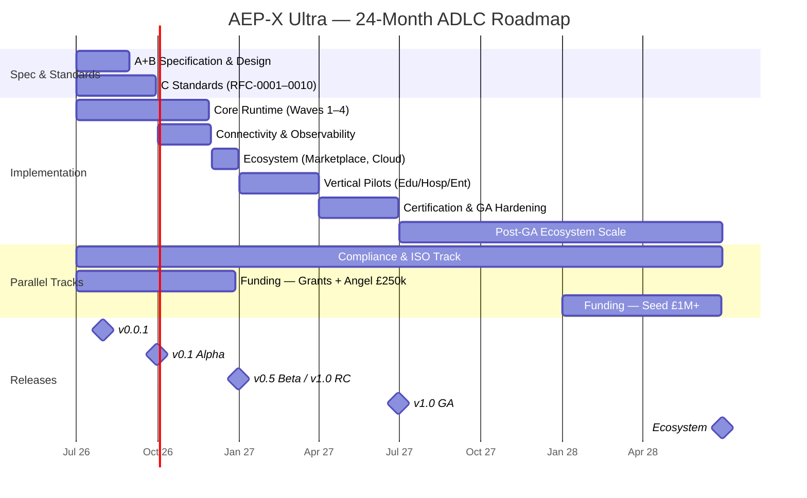

# AEP-X Ultra — Agentic Development Life Cycle (ADLC) Plan

**Source:** AEP-X Ultra Project Manual — Consolidated Edition (3,188 pages)
**Prepared:** 7 July 2026
**Status:** Draft v1.0 for review
**Owner:** Equality Software Ltd / AEP-X Programme

---

## 1. Purpose & Scope

This ADLC Plan translates the AEP-X Ultra Project Manual into a single, executable development life cycle. The manual contains many overlapping roadmaps (Stages 1–20, Phases 1–20, G1–G10, 12 workstreams, 100-day plans, 24-month plans, 5-year and 10-year programmes). This plan **reconciles them into one lifecycle** with clear phases, gates, deliverables, and metrics, following the manual's own directive: *"stop creating stages, start shipping"* and the 180-day Execution Lock (no new architecture, no new framework layers, no new conceptual stages).

**What is being built:** AEP-X Ultra — the Autonomous Enterprise Protocol eXtended, a universal interoperability layer and runtime for agentic AI: cache-first cost optimisation, multi-layer memory, anti-hallucination/evidence engine, trust & governance, universal connectivity (MCP, REST, gRPC, Kafka, etc.), marketplace, and certification ecosystem.

---

## Roadmap at a Glance (24 Months)



Decision gates: G1 Concept (M1) → G2 Business Case (M2) → Alpha Gate (M3) → G3 MVP (M6) → G4 Pilot (M9) → G5 Commercial Launch (M12) → G6 Expansion (M18–24). A styled visual version of this roadmap is in [ADLC-Plan.html](ADLC-Plan.html).

---

## 2. ADLC Methodology

The lifecycle is **SPARC-X native** (the manual's own methodology), wrapped around continuous agentic loops:

| ADLC Phase | SPARC-X | Core Question |
|---|---|---|
| A. Specification | S — Specification | What must the system do, for whom, under which constraints? |
| B. Design | P + A — Pseudocode, Architecture | How do agents reason, remember, decide, recover? |
| C. Standards & Governance | (Constitution/RFC track) | What rules bind every component before code exists? |
| D. Implementation | (Build waves) | Build the 13 core services + SDKs, spec-driven |
| E. Validation | R — Refinement | Does it meet the gates: performance, safety, cost, compliance? |
| F. Release | C — Completion | Alpha → Beta → RC → GA with exit criteria |
| G. Operations | X — Continuous Optimisation | Run, observe, respond, comply |
| H. Learning & Evolution | X — Continuous Optimisation | Feedback → Learning → Model/RFC updates (the agentic loop) |

Two invariant loops run through every phase:

- **Anti-hallucination loop** (RFC-0007): Question → Memory → Knowledge → Evidence → Validation → Response, with confidence bands (Verified 95–100 / High 80–94 / Medium 60–79 / Unverified 0–59) and mandatory human oversight for S3/S4 risk classes.
- **Cost-elimination loop** (RFC-0008): Cache → Memory → Knowledge → Workflow → Tool → Prediction → Small → Medium → Large Model → Human. The LLM is the last resort. (Invariants C1–C4: never invoke an LLM if cache/memory/knowledge has the answer; never use a premium model when a cheaper one meets confidence thresholds.)

And ten constitutional laws govern all development (AEP-X Zero), most notably: *Identity Before Interaction, Trust Before Execution, Evidence Before Assertion, Knowledge Before Generation, Reuse Before Computation, Human Authority in critical domains* (finance, legal, healthcare, child-related decisions).

---

## 3. Phase A — Specification (Weeks 1–4)

**Objective:** Freeze what is being built and why, before any architecture work.

| Deliverable | Content | Source |
|---|---|---|
| Vision & Strategy Pack | Executive vision, PESTEL analysis, SWOT, mission KPIs | Manual pp. 4–6 |
| Business Requirements (BRD) | Stakeholder analysis, market gap, competitive positioning (vs MCP, LangGraph, CrewAI, AutoGen) | PRD-001 |
| Functional Requirements | FR-001…FR-013 — one per core service (Registry, Discovery, Gateway, Memory, Cache, Knowledge, Identity, Trust, Policy, Audit, Workflow, Safety, Verification) | PRD-001 |
| Non-Functional Requirements | Performance, availability, scalability (10M agents design ceiling), security, cost targets (§9) | Phase 3 spec |
| Compliance Requirements | UK GDPR, GDPR, EU AI Act, ISO 27001, ISO 42001, SOC 2, NIST AI RMF, DPA 2018 | SEC-001, AIA-001 |
| User Stories & Acceptance Criteria | 100–500 stories, product backlog | Phase 2 spec |

**Gate A (Concept Approval):** Strategic alignment confirmed; requirements baselined; risk register opened.

---

## 4. Phase B — Design (Weeks 3–8, overlaps A)

**Objective:** Produce the architecture baseline that all code is generated from.

**Deliverables:**

1. **Domain-Driven Design** — 8 core domains, bounded contexts.
2. **Protocol Design** — message envelope, 8 message types, capability/agent/cost/safety contracts.
3. **Layered Reference Architecture** — the 20-layer model (Infrastructure → Connectivity → … → Constitution) mapped to microservices.
4. **Data Architecture** — canonical data model; PostgreSQL (system of record), pgvector (embeddings), Neo4j (knowledge graph), Redis (cache), Kafka (events), MinIO (objects).
5. **Memory Design** — M0 Prompt → M1 Session → M2 Episodic → M3 Semantic → M4 Procedural → M5 Organisational → M6 Federated, each with TTL and governance metadata.
6. **Cache Design** — L0 Prompt (5 min) → L1 Session (1 h) → L2 Agent (24 h) → L3 Workflow (7 d) → L4 Organisation (30 d) → L5 Federation (policy), target >90% hit rate.
7. **Reasoning/Decision/Risk/Recovery flows** (SPARC-P pseudocode) for every agent and the workflow engine.
8. **Security Architecture** — Zero Trust; OIDC/OAuth2/JWT/mTLS; RBAC + ABAC + PBAC; TLS 1.3 in transit, AES-256 at rest; Vault for secrets; threat model covering prompt injection, data poisoning, model manipulation, credential theft, supply chain.
9. **API Standards** — OpenAPI-first REST (`/api/v1/`), response envelopes, health endpoints, X-Request/Correlation/Trace-ID propagation.
10. **Code Generation Framework (CGF-0001)** — spec compiler that generates OpenAPI, schemas, service scaffolds, SDK stubs, Helm/Terraform, and conformance tests (target: 80% auto-generation, 70% dev-time reduction).

**Gate B (Business Case + Architecture Approval):** RA-0001…RA-0008 equivalents baselined; canonical data model frozen; ADR repository live.

---

## 5. Phase C — Standards & Governance Foundation (Weeks 1–12, parallel track)

**Objective:** Establish the authority everything else depends on. Without RFC-0001, developers cannot build.

| Week | Deliverable |
|---|---|
| 1–2 | AEP-X Constitution v1.0 + Book of Laws (10 laws); Foundation Charter; governance bodies defined |
| 3–7 | **RFC-0001** Core Protocol, **RFC-0002** Identity & Trust, **RFC-0003** Messaging/Events/Workflow, **RFC-0004** Discovery & Federation, **RFC-0005** Memory/Knowledge/Cache — frozen as v1.0 Draft |
| 6 | GitHub organisation + monorepo (`aepx-core`: RFCs, schemas, SDKs, services, tests, docs); CI/CD; contribution guidelines |
| 8–12 | **RFC-0006** Governance/Compliance/Audit, **RFC-0007** Safety/Anti-Hallucination, **RFC-0008** Economic Optimisation, **RFC-0009** Marketplace, **RFC-0010** Certification |

**Standards lifecycle:** Draft → Review → Public Consultation → TSC Approval → Publication → Deprecation. No breaking changes within v1.x (SEMVER discipline).

**Governance bodies (minimum viable):** Technical Steering Committee, Security Council, Certification Council, Community Council; Board-level Audit & Risk Committee. Full Foundation registration targeted Month 18.

**Gate C (Standards Freeze):** RFC-0001–0005 published and frozen; monorepo and CI/CD operational.

---

## 6. Phase D — Implementation (Months 1–12)

**Objective:** Build the 13-service core runtime plus SDKs, cache-first, spec-driven. This is the manual's 180-day Execution Lock scope followed by ecosystem waves.

### 6.1 Build order (critical path)

The manual's critical path is strictly sequential because of the constitutional laws (identity before trust, trust before execution):

```
Wave 1 — Access Layer:        Registry → Discovery → Gateway
Wave 2 — Intelligence Layer:  Memory → Cache → Knowledge
Wave 3 — Trust Layer:         Identity → Trust → Policy → Audit
Wave 4 — Execution & Safety:  Workflow → Safety → Verification
Wave 5 — Ecosystem:           Marketplace → Certification → Developer Portal → Billing → Licensing
Wave 6 — Platforms & Pilots:  Cloud MVP → Education → Hospitality → Enterprise
```

> Note: identity/trust plumbing (JWT, OIDC) is stubbed in Wave 1 and hardened in Wave 3 — the manual's week-by-week plan builds Identity and Trust first in minimal form (Week 1) and productionises them in Wave 3.

> **Detailed build reference:** the bounded-context service boundaries, communication patterns (sync Tier 1 vs. event-driven Tier 2), database-per-service enforcement, and step-by-step code for Wave 1–4 are specified in the companion **Microservices Implementation Guide**, which also reconciles this Wave numbering against the AEP-X Ultra book outline's Volume 9 service catalogue (Agent Registry, Trust Authority, Discovery, Memory, Workflow Engine, Safety Engine, Governance Engine, Marketplace Engine).

### 6.2 Month-by-month schedule (Year 1 Operating Plan)

| Month | Deliverables | Milestone |
|---|---|---|
| 1 | Identity + Trust (minimal), Registry, Memory, Cache, Gateway MVPs; Python SDK; Tutor Agent demo | **v0.0.1** — first installable version (docker compose up) |
| 2 | Discovery Service, Workflow Engine, Vector Memory (pgvector), MCP compatibility adapter | Runtime Kernel (execution, scheduling, routing) |
| 3 | Knowledge, Evidence, Anti-Hallucination, Policy services; TypeScript SDK; CLI (`aepx init/create/run/deploy`) | **v0.1 Alpha** |
| 4 | Universal Connectivity Layer: protocol adapters (MCP/REST/GraphQL/gRPC/Kafka/MQTT), AI connectors (OpenAI, Anthropic, Gemini, Ollama, vLLM…), first tool/data connectors | Connect-once-use-everywhere proven |
| 5 | Hardened Identity/Trust/Policy/Audit (Wave 3 complete); observability stack (Prometheus, Grafana, OpenTelemetry, Jaeger, OpenSearch) | Trusted execution, 100% audit coverage |
| 6 | Marketplace MVP, Trust Authority, Cloud MVP; load/security/compliance testing | **v0.5 Beta → v1.0 RC** |
| 7–9 | Education pilot (Tutor/Curriculum/Assessment agents), Hospitality pilot (Search/Booking/Pricing), first enterprise pilot; case studies; beta programme | 3 pilots running |
| 10–12 | Certification platform, Developer Portal, Enterprise Edition packaging; GA hardening; documentation portal | **v1.0 GA** (Month 12) |

### 6.3 Engineering practices

- **Spec-driven development:** services generated/validated against RFC schemas via CGF-0001; 100% standards compliance and API consistency are hard requirements.
- **Sprint cadence:** 2-week releases (Engineering Board KPI); every sprint follows the manual's 20-step structure ending in explicit success criteria.
- **Team structure (Year 1, ~7 people):** Founder/Chief Architect; 2× Backend Engineers; AI Engineer; DevOps Engineer; QA Engineer; Product Owner — organised as Team A (Core Platform), Team B (Developer Experience), Team C (Trust & Security), Team D (Pilots). Growth: 12–15 (Year 2), 20–25 (Year 3).
- **Definition of Done (every service):** OpenAPI contract + schema published; unit tests >85–90% coverage; integration tests for critical flows; Dockerfile + Helm chart; observability instrumented; audit events emitted; conformance tests passing; docs published.

**Gate D (MVP Approval):** All 13 core services operational; the full chain Gateway → Registry → Discovery → Workflow → Safety → Verification executes end-to-end.

---

## 7. Phase E — Validation (continuous; formal gates at Months 3, 6, 12)

### 7.1 Test categories (RFC-0010 conformance suite)

| Category | Scope | Key thresholds |
|---|---|---|
| Functional | Protocol, APIs, workflows, memory, trust, safety | 100% critical flows |
| Performance | Latency, throughput, scaling | See §9 targets |
| Security | AuthN/AuthZ, encryption, audit, dependencies, secrets | 0 critical vulnerabilities |
| Safety | Evidence coverage, verification, risk classification, hallucination testing | ≥95% evidence coverage, <1% critical hallucination on 1,000-question benchmark |
| Compliance | GDPR, UK GDPR, EU AI Act, ISO 27001/42001, SOC 2 | 100% of controls evidenced |
| Interoperability | MCP compat, federation, cross-org workflows, multi-region | 3 independent implementations (GA+) |

### 7.2 Alpha Gate Review (Month 3) — five gates

1. **Technical:** Discovery <50 ms, Memory <20 ms, Cache >90% hit, Gateway <100 ms.
2. **Developer Experience:** install <5 min, first agent <10 min, first workflow <15 min, deployment <30 min.
3. **Cost:** measured cost per execution vs plain-LLM baseline (target trajectory to 80% LLM-call reduction).
4. **Anti-Hallucination:** 100-question known-answer benchmark; evidence and confidence scoring validated.
5. **Competitive Benchmark:** vs MCP, LangGraph, CrewAI, AutoGen, OpenAI Agents SDK on latency, cost, complexity, extensibility, DX.

**Decision:** refactor or proceed to Beta. The parallel **Reality Validation Programme** publishes the benchmark report (pass/fail per area) — this is the honesty mechanism against over-engineering.

### 7.3 Beta exit (→ RC) and RC exit (→ GA)

- **Beta exit:** 99% reliability; <100 ms gateway; <20 ms memory; 3 pilots; 100 developers; 10 organisations; measured 50% cost reduction.
- **RC exit:** 99.9% reliability; 90% cache hit; 80% LLM reduction; conformance suite published; independent security audit passed; 3 production pilots; 1,000 developers; positive unit economics; funding secured.

---

## 8. Phase F — Release Management

**Versioning:** SEMVER (PATCH = fix, MINOR = feature, MAJOR = breaking). v1.x backward compatible. Python & TypeScript SDKs supported ≥3 years.

| Release | Target | Content | Exit criteria owner |
|---|---|---|---|
| v0.0.1 | Month 1 | 6 minimal services + Python SDK + demo agent | Engineering Board |
| v0.1 Alpha | Month 3 | + Discovery, Workflow, Vector Memory, MCP compat, Anti-Hallucination | Alpha Gate Review |
| v0.5 Beta | Month 6 | + Security hardening, UCL connectors, Marketplace MVP, cost optimiser, pilots | Beta exit gates |
| v1.0 RC | Months 6–9 | Core frozen; specs published; conformance suite; security audit | RC exit gates |
| v1.0 GA | Month 12 | Full platform + 3 verticals + Certification + Foundation launch | GA launch programme (10 deliverables) |
| Post-GA | Months 13–24 | Enterprise/Government editions; LTS programme; ecosystem scale | PEB |

**GA Launch Programme (10 deliverables):** public launch (site/portal/forum), Foundation formalised, certification programme live, marketplace launch (targets: 100 agents, 50 workflows, 20 plugins at launch; 1,000/500/100 within first release cycle), 10 university partnerships, industry accelerators, published benchmarks, commercial model (Open Source / Professional £99–499/mo / Enterprise £25k–250k/yr), standards expansion working groups, AEP-X 2.0 research kickoff.

---

## 9. Non-Functional Targets (binding through all phases)

### Performance & reliability

| Metric | MVP (Mo. 6) | GA (Mo. 12) | Year 3 |
|---|---|---|---|
| Availability | 99.9% | 99.99% | 99.999% |
| Gateway latency | <100 ms | <100 ms | <100 ms |
| Discovery | <50 ms (<10 ms cached) | <50 ms | <50 ms |
| Memory retrieval | <20 ms (<5 ms cached) | <20 ms | <20 ms |
| Cache hit lookup | <5 ms | <5 ms | <5 ms |
| Policy / trust evaluation | <50 ms | <50 ms | <50 ms |
| Audit write / search | <10 ms / <100 ms | same | same |
| Workflow start / planning / recovery | <100 / <200 / <500 ms | same | same |
| Verification per claim | <200 ms | <200 ms | <200 ms |

### Economics (the platform's core differentiator)

| Metric | Target |
|---|---|
| Cache hit rate | >90% (→95%) |
| LLM call reduction | 80% (→90%) |
| Memory reuse | 90% |
| Workflow reuse | 70–80% |
| Infrastructure cost reduction | 50% |
| Energy reduction | 30% (→50% long-term) |

### Safety & quality

| Metric | Target |
|---|---|
| Evidence coverage | ≥95% |
| Verified responses | ≥90% |
| Critical hallucination rate | <1% |
| Human oversight, S3/S4 & regulated domains | 100% |
| Auditability / traceability / explainability | 100% |
| Unit test coverage | >85–90% |
| Defect escape rate | <2% |
| Release success rate | >95% |

---

## 10. Compliance & Certification Roadmap (parallel track, Months 1–30)

| Phase | Months | Outcome |
|---|---|---|
| 1 | 1–6 | Governance foundation: POLICY-001, RISK-001, QUALITY-001, DATA-001, AUDIT-001 live |
| 2 | 6–12 | **ISO 9001** (QMS) |
| 3 | 9–15 | **Cyber Essentials Plus** |
| 4 | 12–18 | **ISO 27001** (ISMS) |
| 5 | 15–21 | **ISO 22301** (BC/DR: RTO <4 h, RPO <1 h for Tier-1 services) |
| 6 | 18–24 | **ISO 42001** (AI management) — supported by AIA-001 AI Assurance Framework |
| 7 | 24–30 | **SOC 2** readiness |

**AI-specific controls (AIA-001, EU AI Act):** risk classification R0–R4 for every AI system; DPIAs for all high-risk features; AI system inventory; transparency metadata (purpose, owner, version, risk level, limitations); explainability contract on every response (`{answer, confidence, evidence[], verification_status}`); bias & fairness monitoring; mandatory human oversight for high/critical risk. Data retention: audit logs 7 years, security logs 2 years, application logs 90 days.

**Incident response:** P1 15-min / P2 1-h / P3 4-h / P4 next release. Vulnerability SLAs: critical 24 h, high 7 d, medium 30 d.

---

## 11. Governance, Risk & Decision Gates

### Stage-gate framework (PMO-001)

| Gate | Name | When |
|---|---|---|
| 1 | Concept Approval | End of Phase A |
| 2 | Business Case Approval | End of Phase B |
| 3 | MVP Approval | Month 6 |
| 4 | Pilot Approval | Months 7–9 |
| 5 | Commercial Launch Approval | Month 12 (GA) |
| 6 | Expansion Approval | Month 18–24 |

### Programme Execution Board (weekly command centre)

Six boards with single KPIs: Standards (RFCs frozen/traceable), Engineering (release every 2 weeks), Security (zero critical vulnerabilities), Product (one new pilot per quarter), Commercial (first paying customer, then ARR), Foundation (100 active contributors). Five dashboards: Product (WAU — *the single most important KPI*), Technology, Economics, Trust & Safety, Growth.

### Top risks & mitigations

| Risk | Score | Mitigation |
|---|---|---|
| Data breach | Critical (20) | Encryption everywhere, MFA 100%, monitoring, security reviews |
| GDPR non-compliance | Critical (16) | Privacy by design, DPIAs, training, DATA-001 |
| Funding delays | High (15) | Staged plan: bootstrap/grants (£250k, Mo. 6) → seed £1M+ (Mo. 24) → Series A (Yr 3–4); Innovate UK/UKRI applications in parallel from Month 1 |
| Supply chain attack | High (15) | SBOM, dependency scanning, code signing (Trivy/Syft/Cosign) |
| Slow adoption | High (12) | Pilot early, university partnerships, free open-source core, <10-min first agent |
| EU AI Act non-conformity | High (12) | AIA-001 framework, independent reviews |
| Over-engineering | High | **180-day Execution Lock**; Reality Validation Programme; WAU as north-star metric |
| Vendor capture / fragmentation | Medium | Non-profit foundation, open RFCs, conformance testing, 3 independent implementations |

---

## 12. Phase G/H — Operations, Learning & Evolution (Month 6 onward, permanent)

- **Operations (OPS-001):** GitOps deployment (ArgoCD, Helm, Terraform); multi-AZ; automated backups (hourly incremental, daily full, 35-day retention); quarterly tabletop exercises, twice-yearly recovery tests, annual full DR exercise; SLO-based alerting.
- **Learning loop (Law 9):** every interaction feeds Experience → Knowledge → Learning → Improvement; the ML fabric (classification, prediction, recommendation) retrains from outcomes; cost optimiser continuously re-tunes model routing.
- **Evolution loop (Law 10):** telemetry and pilot feedback drive RFC updates through the standards lifecycle; AEP-X 2.0 research stream starts at GA; deprecation policy protects backward compatibility.
- **Post-GA programme:** independent implementations, interop lab, conformance certification, connector expansion, global education programme, industry accelerators (Education, Hospitality, Government, Healthcare, Finance), AEP-X Cloud.

---

## 13. Adoption & Commercial Milestones (success criteria per period)

| Milestone | Developers | Organisations | Universities | Revenue | Release |
|---|---|---|---|---|---|
| Month 3 | 100 | 1–3 pilots | 1 contact | — | v0.1 Alpha |
| Month 6 | 500 | 10 | 1–2 | first paying customer | v0.5 Beta / RC |
| Month 12 | 1,000 | 100 | 10 | £100k ARR | **v1.0 GA** |
| Month 24 | 5–10k | 500–1,000 | 25–30 | £500k–£1M ARR | Ecosystem |
| Year 3 | 5,000–10,000 | 200–1,000 | 25–100 | £2M ARR | Enterprise scale |
| Year 5 | 100,000 | 1,000 | 100 | £10M+ ARR | Industry leadership |

Marketplace at first release cycle: 1,000 agents, 500 workflows, 100 plugins, 100 knowledge packs. Certification Year 1: 100 certified developers (5-level track: Developer → Engineer → Architect → Enterprise Architect → Fellow; exams £150–£1,500).

---

## 14. Immediate Next Actions (Days 1–30)

1. **Week 1:** Register GitHub org + domains; publish Constitution v1.0 draft and Book of Laws; stand up docs portal skeleton.
2. **Week 2:** Freeze RFC-0001–0005 as v1.0 Draft; publish OpenAPI schemas and canonical data model; monorepo + CI/CD live.
3. **Week 3:** First running services — Identity (minimal), Trust (minimal), Registry, Memory, Cache, Gateway via docker compose.
4. **Week 4:** Python SDK v0.0.1 (`pip install aepx`); Tutor Agent demo end-to-end; measure: time-to-first-agent <10 min.
5. **In parallel:** Innovate UK application drafted; 2 university conversations opened; risk register and policy library (POLICY-001) initialised.

**Definition of success for Month 1:** a new developer can go from `git clone` to a working evidence-validated agent in under 10 minutes — everything else in this plan exists to keep that loop true at scale.

---

## 15. Critical Evaluation

This section assesses the manual — and therefore this plan — honestly. The manual itself demands it: the Reality Validation Programme, the 180-day Execution Lock, and the warning that *"if nobody uses AEP-X, architecture = 0 value"* are the manual auditing its own ambition. This section extends that audit.

> **Overall verdict:** The manual is a visionary and unusually complete *portfolio of ambitions*, but not yet an executable plan. Its genuine differentiators (cache-first economics, evidence-first anti-hallucination, compliance-by-design) are buried under a scope no Year-1 team of 7 can deliver, and the document carries material internal contradictions from iterative drafting. This ADLC plan is executable **only under the manual's own Execution-Lock reading**: 6 services, one SDK, one vertical, one paying customer — everything else held as conditional backlog.

### 15.1 What is genuinely strong

1. **Cache-first economics is a real, measurable differentiator.** The execution hierarchy (cache → memory → knowledge → … → LLM last) attacks the dominant cost line of agentic systems; no mainstream framework makes it a protocol invariant. It is also falsifiable — the cost dashboard either shows the savings or it doesn't.
2. **Evidence-first anti-hallucination fills a genuine gap.** A response contract of `{answer, confidence, evidence[], verification_status}` with risk-tiered human oversight is what regulated buyers ask for and don't get from current stacks.
3. **Compliance-by-design is well timed** for where EU AI Act / ISO 42001 procurement is heading in 2026–2028.
4. **The manual is self-aware.** The Execution Lock, the RVP, and "WAU is the only KPI that matters" are the document correcting its own sprawl — its best strategic thinking is its scepticism about itself.
5. **The critical path is architecturally sound** (identity → trust → registry → memory → execution), and the 20-step sprint template is solid delivery discipline.

### 15.2 Critical weaknesses

1. **Scope–capacity mismatch is the central defect.** Year 1 asks 7 people for 13 production services, 2 SDKs, a CLI, marketplace, certification platform, 3 pilots, a standards body, 10 RFCs and 2 ISO certifications — roughly 2 production services per engineer *plus* everything else. Kubernetes had Google; MCP has Anthropic. At production quality this is 25–40 person scope; the §6.2 schedule is achievable only at MVP/scaffold quality.
2. **Head-on competition with MCP is the largest market risk.** A protocol war fought by a bootstrapped startup against an incumbent with first-mover network effects is unwinnable on those terms; an MCP-*complementary* position (the memory/cache/trust/evidence layer for MCP deployments) is winnable.
3. **The standards-body strategy is inverted.** Constitution, Book of Laws, Foundation and 10 frozen RFCs are scheduled *before* a single external user exists. Every successful precedent (TCP/IP, OAuth, Kubernetes/CNCF) ran the other way: implementation → adoption → standardisation.
4. **Key performance targets are asserted, not evidenced** (see §15.4). Publishing them as platform guarantees before pilot data risks a credibility failure exactly when the public benchmarks (Alpha Gate 5) land.
5. **The funding maths does not close.** £250k cannot carry 7 UK FTEs for 12 months (~£600–700k loaded). Either the team is 3–4 people or more capital comes earlier; the plan currently pretends neither.
6. **No adoption mechanism behind the adoption targets.** 1,000 developers by Month 12 with no DevRel headcount and no marketing budget line, against an incumbent with default distribution.
7. **Compliance overhead is front-loaded onto scarce capacity.** Six ISO certifications in 30 months diverts the same 7 people; only GDPR fundamentals and Cyber Essentials are needed pre-revenue.
8. **The manual's provenance shows.** The 3,188-page consolidated edition stacks ~20 successive re-plannings of the same programme without reconciliation; terminology drifts between passes (§15.3). Implementing directly from the manual, rather than from a reconciled plan, will produce inconsistent systems.

### 15.3 Contradiction register (resolve before build)

| Topic | Conflicting statements in the manual | Resolution adopted here |
|---|---|---|
| Memory layers | M0–M5 (p.11) vs M0–M6 (RFC-0005) | M0–M6 (RFC-0005 normative) |
| Cache layers | L1–L4 vs L0–L5 vs L0–L6 | L0–L5 (RFC-0005) |
| Availability | 99.9% vs 99.99% vs 99.999% for overlapping periods | Staged: 99.9% MVP → 99.99% GA → 99.999% aspirational Yr 3 |
| Trust formula | 5 × 20% (RFC-0002) vs 40/30/20/10 (build chapters) | RFC-0002; revisit with pilot data |
| Safety classes | S0–S3 (RFC-0007) vs S0–S4 (elsewhere) | S0–S4, human oversight at S3+ |
| RFC numbering | RFC-0008 = Safety (Stage 2) vs Economic Optimisation (RFC suite); "8 standards" vs "10 RFCs" | 10-RFC suite per §5 |
| Year-1 adoption | 100 devs/10 orgs (EXEC-001) vs 1,000/100 (Y1OP) vs 10,000+/1,000+ (ROADMAP-001) | Y1OP ladder as stretch; EXEC-001 as commit case |
| Year-1 revenue | £50k–£100k (FIN-001) vs £100k ARR (Y1OP) vs >£400k (investor KPIs) | £100k stretch, £50k commit |
| MVP duration | 90 days vs 6 vs 9 vs 12 months | v0.0.1 @ 30d, Alpha @ 90d, GA @ 12mo |

### 15.4 Reality check on headline targets

| Claim | Assessment |
|---|---|
| >90–95% cache hit rate | **Conditional.** Plausible for narrow repetitive domains (education FAQ-style); agentic long-tail workloads land far lower. Make it an SLO per workload class, never a platform guarantee. |
| 80% LLM cost reduction | **Derivative of the above.** Credible in the education pilot; unproven generally. Publish measured pilot numbers, not the target. |
| <20 ms memory retrieval | **Optimistic for semantic search.** pgvector ANN at scale typically 20–100 ms+; achievable only cache-fronted. Keep <5 ms cached; restate uncached honestly. |
| 99.999% availability (Yr 3) | **Conflicts with low-cost positioning.** Five nines = multi-region active-active + SRE bench (>£1M/yr ops). 99.9–99.95% is the honest Year 1–3 band. |
| 13 services in 6 months, team of 7 | **Not credible at production grade.** Feasible only as code-generated scaffolds — and the code generator (CGF-0001) is itself an unbuilt critical-path dependency. |
| <1% critical hallucination, ≥95% evidence coverage | **Unmeasurable as stated.** Needs a pre-registered benchmark methodology (dataset, judge protocol, domain spread) before the number means anything. |
| 1,000 developers by Month 12 | **No mechanism.** Requires funded DevRel and an MCP-compatible on-ramp; treat 100–300 as the commit case. |
| Standards-body recognition | **Years premature.** Recognition follows adoption; schedule after 3 independent implementations exist. |

### 15.5 Recommendations

1. **Make the Execution Lock the actual plan.** Year-1 committed scope: 6 services, Python SDK, education vertical, 1 paying customer. Waves 5–6, the Foundation and 5 of 10 RFCs move to a backlog gated on pilot evidence.
2. **Reposition relative to MCP: complement, not competitor.** Ship the MCP adapter in Month 1 and market AEP-X as "the memory, cost and evidence layer for MCP agents". Inherit the ecosystem instead of fighting it.
3. **Demote RFCs to living design docs** until third-party implementers exist; freeze only the wire format and response contract.
4. **Fix the funding maths before hiring:** raise ~£600–750k pre-seed for the 7-FTE plan, or run Months 1–6 with 3–4 people and cut the Month-6 milestone list. The current £250k/7-FTE combination fails in Month 5.
5. **Re-baseline public targets to defensible numbers**; keep aspirational figures internal until pilots evidence them.
6. **Build the public benchmark suite (RVP) in Month 2, not after Alpha** — it is the credibility engine for every economic claim, and the cheapest marketing available.
7. **Adopt the contradiction register (§15.3) as a living document** with one normative source per topic.
8. **Defer ISO 42001 and SOC 2 to post-revenue;** keep GDPR fundamentals, Cyber Essentials, and AI risk classification from day one — the anti-hallucination product story depends on them.

---

## Appendix A — Reconciliation Map (manual roadmaps → this plan)

| Manual construct | Where it lands in this ADLC |
|---|---|
| SPARC / SPARC-X lifecycle | §2 methodology; phases A–H |
| Development Guide Phases 1–20 | Phases A–E deliverables |
| Genesis Implementation Programme G1–G10 | G1–G2 → Phase C; G3–G4 → Phase D; G5–G7 → Waves 5–6 + §13; G8 → §11 funding; G9–G10 → §12 post-GA |
| Stage 5 (12 workstreams, 9 months) & Stage 14-bis (12-month build) | §6.2 month-by-month schedule |
| 100-Day Plan / 90-Day FES / Day 1–30 checklist | §14 immediate actions + §6.2 Months 1–3 |
| 24-Month Execution Plan (EXEC-001) | §6.2 + §13 milestones |
| MVP v1.0 6-phase / 6-sprint plans | §6.1 build waves |
| Alpha/Beta/RC/GA programmes | §7 gates + §8 releases |
| ISO-001 certification roadmap | §10 |
| TRANSFORM-001 5-year / SEP 10-year | §13 (Years 3–5 summarised; out of ADLC execution scope) |
| RVP / PoV / FCP / SRP / SGSG | §7.2 validation, §12 evolution, §13 adoption |

## Appendix B — Technology Stack (reference implementation)

FastAPI (services) · PostgreSQL + pgvector · Neo4j · Redis/Redis Cluster · Kafka · Temporal (workflow) · Keycloak (identity) · Open Policy Agent · HashiCorp Vault · Docker/Kubernetes/Helm/Terraform/ArgoCD · Prometheus/Grafana/OpenTelemetry/Jaeger/OpenSearch/AlertManager · MinIO · Next.js (portals) · Python & TypeScript SDKs (then Java, Go, Rust).
